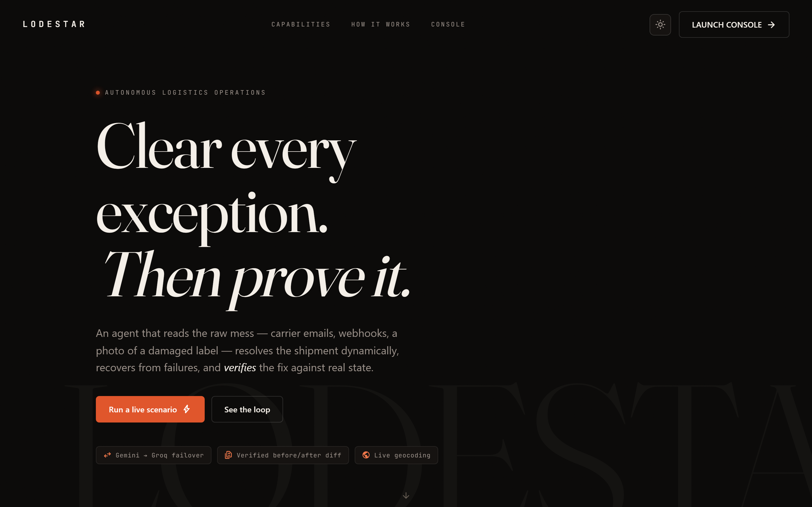
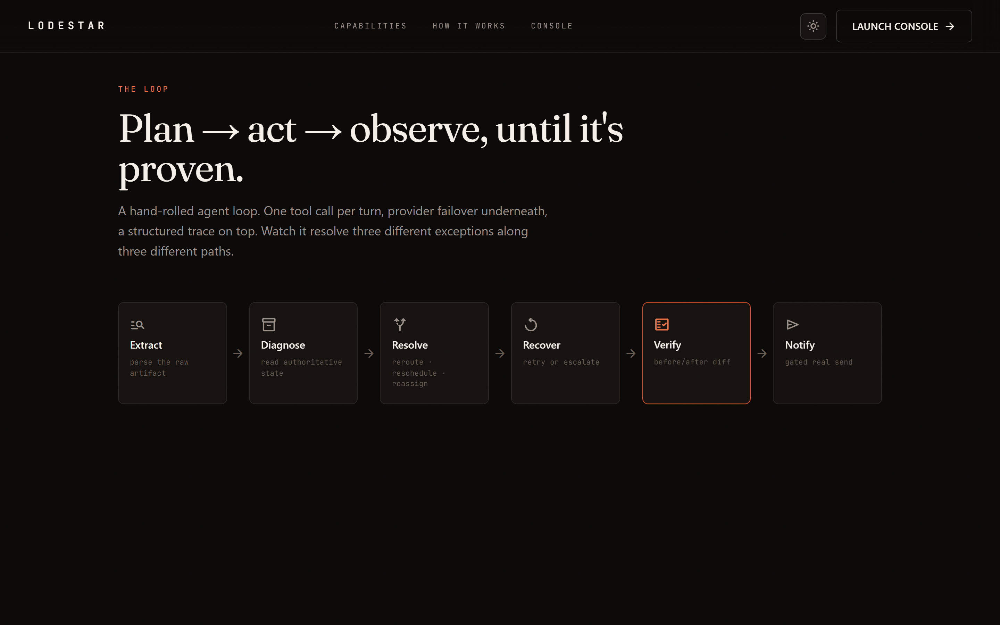
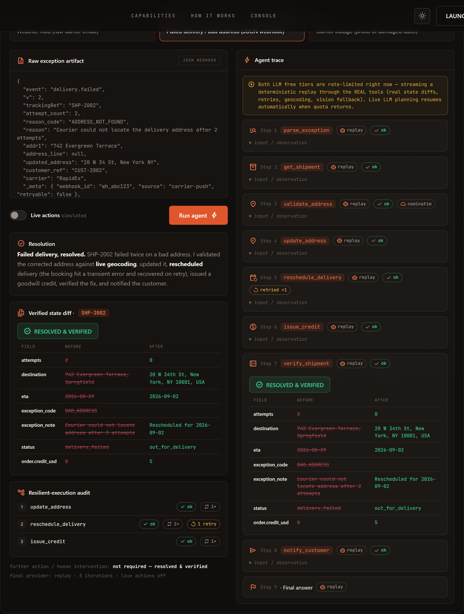
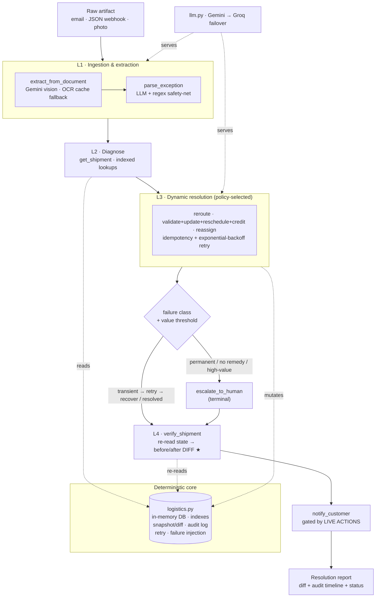

<div align="center">

# 🛰️ LODESTAR

### Autonomous Logistics Exception Agent

**Understand the mess. Act on it. Prove it moved.**

*Most agents take an action and claim victory. This one re-reads the world and proves it moved.*




</div>

---

## Table of contents

- [The problem](#the-problem)
- [What LODESTAR does](#what-lodestar-does)
- [Screenshots](#screenshots)
- [Demo scenarios](#demo-scenarios)
- [Architecture](#architecture)
- [Tech stack](#tech-stack)
- [Project structure](#project-structure)
- [Getting started](#getting-started)
- [Running & testing](#running--testing)
- [Reliability & safety](#reliability--safety)
- [Observability (operator console)](#observability-operator-console)
- [Requirements coverage](#requirements-coverage)
- [Design decisions](#design-decisions)
- [Roadmap](#roadmap)
- [Docs](#docs)

---

## The problem

Logistics operations drown in **exceptions** — damaged packages, bad addresses, carrier
outages, failed deliveries — and they arrive as **unstructured noise**: an autogenerated
carrier email with a tracking id buried mid-paragraph, a webhook with inconsistent fields, a
photograph of a damaged label. Resolving one today means a human reading the mess, checking
several systems, coordinating with carriers and customers, and performing multiple actions
before a shipment can move again.

- **Fixed workflow automation** can encode a handful of cases, but the long tail defeats rigid rules.
- **An advisory chatbot** tells you what to do — it doesn't move the shipment.

LODESTAR is the third thing: an **autonomous agent that reads the raw artifact, resolves the
exception with real state-changing actions, and verifies the outcome against authoritative
state** — retrying transient failures, escalating permanent ones to a human, and never
claiming success it can't prove.

---

## What LODESTAR does

Given a raw exception artifact, the agent runs a hand-rolled `plan → act → observe` loop and
delivers a **verified** resolution. Three properties make it trustworthy:

| # | Pillar | What it means |
|---|--------|---------------|
| 01 | **Read the mess** | Every run starts from a raw artifact — carrier email, JSON webhook, or a **photo** (vision OCR). The agent extracts the shipment + exception under ambiguity. |
| 02 | **Execute with resilience** | Idempotent state changes, exponential-backoff retry, and a **code-level transient (retry) vs permanent (escalate)** distinction — not a hopeful prompt. |
| 03 | **Prove the fix** | After any change it **re-reads authoritative state** and returns a field-level before/after **diff** with a verified `RESOLVED` — or a deliberate escalation to a human. |

### What makes it stand out

Three things on top of the core loop — the reasons this reads as an agent, not a script:

| | Capability | What it means |
|---|-----------|---------------|
| 🆕 | **Live novel input** | Paste *any* artifact it has never seen — a tracking id buried mid-sentence, a misspelled webhook, a bare number. The agent extracts it with the LLM (a regex can't) and plans dynamically from the **full** tool set. Custom runs are **live-only** — never a canned path. |
| 🧠 | **Confidence-gated clarifying question** | The agent reasons about its **own uncertainty**. When a key field is genuinely ambiguous (e.g. *"Portland"* with no state), it **pauses and asks** with candidate options — and **mutates nothing** until you answer, then resumes to a verified fix. |
| 💬 | **Reasoning you can read** | Every step is in plain operator language ("Looked up the shipment") with a one-line **why**, raw JSON tucked behind *Details*, and a **"Done — and you can prove it"** list built from the real audit log. |

---

## Screenshots

<div align="center">

**Landing — dark & light themes**


**The loop (scroll-animated)**



**Live console — a complete run (scenario B): live geocoding, transient retry, goodwill credit, verified diff**



</div>

> The console streams every step live over Server-Sent Events, then surfaces the **verified
> before/after diff**, a **resilient-execution audit** timeline, and an explicit
> *human-intervention* line. Nothing is faked.

---

## Demo scenarios

Three exception classes, deliberately chosen to span **three input modalities** and **three
distinct tool paths** — so dynamic tool selection is *demonstrated*, not asserted. No single
fixed sequence resolves all three.

| # | Raw input (modality) | Exception | Tool path | Proves |
|---|----------------------|-----------|-----------|--------|
| **A** | Carrier **email** (unstructured) | `WEATHER_HOLD` | parse → get_shipment → list_carriers → **reroute** → verify → notify | email extraction + reroute + verified diff |
| **B** | **JSON webhook** (messy fields) | `BAD_ADDRESS` (2 fails) | parse → get_shipment → **validate_address** (real geocode) → update_address → **reschedule** (transient→retry) → issue_credit → verify → notify | real external call + retry recovery + multi-action fix |
| **C** | **Photo** of a damaged label (vision) | `CARRIER_OUTAGE` (high-value) | extract_from_document → parse → get_shipment → list_carriers → **reassign** (permanent fail) → **escalate** → verify → notify | vision + permanent-failure detection + act-vs-escalate |

Beyond the three fixtures, the console ships **off-script examples** the agent runs *live*:

- **Novel artifacts** — a worded id (`one-zero-zero-one`), a misspelled no-dash webhook
  (`shp2002`), a support ticket with a bare number (`3003`). The regex net returns *nothing*;
  the LLM recovers each and the agent resolves it end-to-end.
- **An ambiguous artifact** — *"send it to Portland"* → the agent **asks which Portland**
  before it touches anything, then geocodes your answer against live OpenStreetMap and resolves.

---

## Architecture

A **layered agent** — an LLM foundation with provider failover, an extraction layer, a
hand-rolled loop, a resilient execution layer over the logistics system, and a
verify-and-diff layer that closes every loop. Every layer is inspectable; there is no
black-box orchestration framework.



**Layers**

| Layer | Component | Responsibility |
|-------|-----------|----------------|
| LLM foundation | [`llm.py`](llm.py) | `chat()` — Gemini primary, Groq failover, provider-agnostic tool calling. Never raises. |
| Ingestion / extraction | [`tools.py`](tools.py) `parse_exception`, `extract_from_document`, `_canonical_sid` | Entity extraction under ambiguity (LLM + regex net; vision + OCR cache); id normalization. |
| Confidence gate 🆕 | [`tools.py`](tools.py) `assess_ambiguity` + [`server.py`](server.py) `/api/clarify` | Per-field confidence on custom input; raises a clarifying question when ambiguous. |
| Agent loop | [`agent.py`](agent.py) | `plan → tool → observe`; policy prompt; verify/notify/permanent-fail guards. |
| Resilient execution | [`logistics.py`](logistics.py) `execute_state_change` | Idempotency + retry + transient/permanent failure class over the mock system. |
| Verify & diff ★ | [`tools.py`](tools.py) `verify_shipment` + [`logistics.py`](logistics.py) `diff` | Re-read authoritative state, compute field-level before/after diff. |
| Transport / UI | [`server.py`](server.py) + [`web/`](web/) | FastAPI + SSE streaming into an editorial console; **plain-language** trace + "prove it" list (`TOOL_PLAIN`, `stepWhy`, `proveList`). |

**Design principles**

- **Deterministic core, probabilistic edge.** The LLM handles extraction and tool selection; state, failure classification, idempotency, and diffing are deterministic code. *Reasoning at the edge; correctness in the core.*
- **Verify or it didn't happen.** No resolution is reported without a re-read — a loop guard makes this non-skippable.
- **Fail loud, recover locally.** Every tool returns a structured dict and never raises; the loop adapts on failure instead of dying.
- **One real external dependency.** `validate_address` hits live OpenStreetMap Nominatim (ground truth we don't control), with a documented fallback so availability never blocks the flow.

---

## Tech stack

| Area | Choice |
|------|--------|
| Language | Python 3.13 |
| LLM | Google **Gemini** (primary) → **Groq** (failover), provider-agnostic tool calling |
| Vision | Gemini multimodal OCR (with on-disk cache fallback) |
| Backend | **FastAPI** + Uvicorn, **Server-Sent Events** for live streaming; `/api/run` (SSE), `/api/clarify`, `/api/meta`, `/api/shipments` |
| Frontend | Hand-built HTML/CSS/JS, **GSAP + ScrollTrigger**, Fraunces / Inter / JetBrains Mono, light + dark themes |
| External API | **OpenStreetMap Nominatim** geocoding (no key) |
| Notifications | Twilio (WhatsApp) · Resend (email) — gated behind `LIVE ACTIONS` |
| Assets | Pillow (generates the damaged-label photo) |

---

## Project structure

```
Hackathon-Citarise/
├── server.py              # FastAPI backend + SSE run stream + /api/clarify  ← primary entrypoint
├── agent.py               # hand-rolled plan→tool→observe loop, policy prompt, guards
├── llm.py                 # Gemini→Groq failover, provider-agnostic tool calling
├── tools.py               # tool surface: parse/reads/state-changes/verify/notify + gates
│                          #   + assess_ambiguity (clarify), _canonical_sid (id normalize)
├── logistics.py           # mock system: DB, indexes, seed, snapshot/diff, retry, failure injection
├── demo_runner.py         # deterministic offline replay (real tools) when LLMs are rate-limited
├── smoke_test.py          # 10 deterministic checks — no real sends
├── make_assets.py         # generates assets/label_SHP-3003.png (scenario C photo)
├── capture_screens.py     # Playwright script that produces the README screenshots
├── app.py                 # legacy Streamlit console (superseded by server.py + web/)
│
├── web/                   # the operator console + landing site
│   ├── index.html         #   structure (nav, hero, pillars, loop, console, off-script strip)
│   ├── style.css          #   design system (themes, plain-language trace, clarify + prove-it)
│   └── main.js            #   GSAP + scenarios + novel examples + clarify flow + SSE + rendering
│
├── assets/
│   ├── label_SHP-3003.png            # generated damaged-label photo (vision input)
│   ├── label_SHP-3003.png.ocr.txt    # cached OCR (vision fallback)
│   ├── PRD_Logistics_Exception_Agent.docx   # product requirements document
│   └── FRD_LODESTAR.docx             # functional requirements (Word copy)
│
├── docs/screenshots/      # README images
├── FRD.md                 # functional requirements (the readable, in-repo copy)
├── CLAUDE.md              # working rules / tool-writing conventions
├── DESIGN.md              # full technical design
├── requirements.txt
├── .env.example           # keys + LIVE_ACTIONS / APPROVAL_THRESHOLD_USD config
└── .streamlit/ · .claude/ # theme + launch configs
```

---

## Getting started

**1. Install**

```bash
pip install -r requirements.txt
python make_assets.py            # one-time: generate the scenario-C label photo
```

**2. Configure** — copy `.env.example` to `.env` and add keys:

```bash
GEMINI_API_KEY=...      # agent planner (primary)
GROQ_API_KEY=...        # agent planner (failover)
# optional — only needed for real customer notifications (LIVE ACTIONS on):
TWILIO_ACCOUNT_SID=...  TWILIO_AUTH_TOKEN=...  TWILIO_WHATSAPP_FROM=...
RESEND_API_KEY=...      RESEND_FROM=...
```

Any missing key degrades gracefully. `validate_address` needs no key.

**3. Run**

```bash
python -m uvicorn server:app --port 8000
```

Open **http://localhost:8000**, scroll to the console, pick a scenario, and hit **Run agent**.

---

## Running & testing

```bash
# Live operator console (landing + streaming console)
python -m uvicorn server:app --port 8000

# Headless single scenario in the terminal (A / B / C)
python agent.py A

# Deterministic checks — DB/indexes/diff/retry/idempotency/geocode/gating (no real sends)
python smoke_test.py            # → 10 passed, 0 failed

# Prove the provider failover live (every step tagged 'groq')
FORCE_GEMINI_FAIL=1 python agent.py A     # PowerShell: $env:FORCE_GEMINI_FAIL=1

# Regenerate README screenshots (server must be running)
python capture_screens.py
```

> **Resilience note:** if **both** free LLM tiers are rate-limited, the console
> auto-falls-back to a **deterministic replay** that streams the *real* tools (real diffs,
> retries, geocoding, vision fallback) — clearly labelled — and hands back to live LLM
> planning the moment quota returns. The demo never dies.

---

## Reliability & safety

**Idempotency** — every state-changing tool derives a canonical idempotency key from its
semantic args *inside the tool*. A repeat returns the cached result (`idempotent_replay`)
with no second mutation — protecting against model repetition and retry double-writes.
→ [`logistics.py`](logistics.py) `execute_state_change`.

**Retry & failure classification** — a bounded exponential-backoff wrapper (~0.2/0.4/0.8s)
wraps state changes. Failures are **typed in code**: `TransientFailure` retries and recovers;
`PermanentFailure` fails fast and forces escalation. The act-vs-escalate decision is a
code-level failure class, not an LLM guess. → [`logistics.py`](logistics.py) `with_retry`.

**Human oversight — three layers:**

| Layer | Mechanism |
|-------|-----------|
| Ambiguous input | **Confidence-gated clarifying question** — on a genuinely ambiguous field the agent **pauses and asks** (`assess_ambiguity` / `/api/clarify`) and mutates nothing until the operator answers. |
| Real outbound sends | `LIVE ACTIONS` toggle (default **off**) gates `notify_customer`; off ⇒ simulated, never calls Twilio/Resend. |
| Financial actions | `issue_credit` approval gate — `APPROVAL_THRESHOLD_USD` (default $100). At/above it, the tool returns `require_approval` (surfaced as an **approval required** chip); with `REQUIRE_APPROVAL=1` it **blocks** (`awaiting_human_approval`) and mutates nothing until sign-off. |
| Unrecoverable / high-value | `escalate_to_human` — a first-class terminal action, surfaced as **ESCALATED TO HUMAN** + an explicit *human intervention: required* line. |

**Loop guards (safety net)** — [`agent.py`](agent.py): a permanently-failed call can't be
re-issued (short-circuits to escalation); a state change can't be finalized without
`verify_shipment`; the customer notification can't be silently dropped.

### Real notifications (verified)

The final step isn't a mock. With **LIVE ACTIONS** on, `notify_customer` sends a genuine
**shipment-update notification** to the customer on their preferred channel — **email via
Resend**, **WhatsApp via Twilio** — using the exact message the agent composed. Below is a
real delivered email from a live run (scenario A, `SHP-1001` rerouted to RapidEx):

> **Subject:** Update on your shipment SHP-1001
> Hello Alice, your shipment (SHP-1001) experienced a delay due to severe weather at the
> Chicago hub. We have rerouted your shipment via RapidEx to minimize delays. Your updated
> ETA is September 1, 2026.

<!-- drop the screenshot at docs/screenshots/06-live-email.png to render it here -->

With LIVE ACTIONS **off** (the default) the same call is simulated and shows a
`would_send` payload — so nothing leaves the building during a demo unless you opt in.

---

## Observability (operator console)

The spec's six visibility requirements are **first-class UI**, not logs:

| Requirement | Where it's shown |
|-------------|------------------|
| Exception identified | `parse_exception` / `get_shipment` step + exception code/note |
| Tools & systems used | Each step card: tool name + provider chip (`gemini`/`groq`/`replay`) + source chip (`nominatim`/vision) |
| Actions performed | State-changing step cards + **Resilient-execution audit** timeline |
| Result of each action | Per-step observation + `ok` / `fail` / `retried ×n` chips |
| Current resolution status | `RESOLVED & VERIFIED` / `ESCALATED TO HUMAN` badge + the verified diff |
| Further action / human intervention | Explicit *"human intervention: required / not required"* line |

---

## Efficiency

Cost and latency are controlled deliberately, not incidentally:

- **Model selection** — small, cost-effective models (`gemini-3.6-flash` / Groq `gpt-oss-20b`), not a frontier model, for a structured tool-selection task.
- **Provider failover** — `llm.py` transparently falls Gemini → Groq, so a rate-limited or down provider never stalls a run (and never wastes a retry on the same dead endpoint).
- **Fewer model calls** — extraction is **deterministic-first**: the regex/keyword extractor resolves clean artifacts with **zero LLM calls**, and the model is invoked only on genuinely ambiguous input. That's typically **one fewer LLM call per run**.
- **Compact context** — tool observations are truncated (`_summarize`, 1200 chars) so the resent conversation stays small across turns; one tool call per turn keeps the loop bounded (`MAX_ITERS=12`).
- **O(1) data access** — the logistics store is **index-backed** (`ship_by_order`, `orders_by_customer`, `carriers_by_region`, `ship_by_tracking`) — no table scans.
- **No wasted work** — a permanently-failed action is never retried (fail-fast), and idempotent tools collapse duplicate calls.

## Requirements coverage

<details>
<summary><b>Capabilities (7/7)</b></summary>

| Capability | Where |
|-----------|-------|
| Understand the exception (3 modalities) | `tools.parse_exception` (LLM + regex) · vision via `extract_from_document` |
| Gather context | `get_shipment`, `list_carriers`, `check_inventory` |
| Dynamic tool selection | 3 distinct paths (A/B/C) — no fixed sequence solves all three |
| Execute real actions | `execute_state_change` + 6 mutating tools |
| Validate execution | `verify_shipment` + `logistics.diff` → before/after table |
| Handle failures | `with_retry` + typed transient/permanent (B retries, C fails-fast) |
| Escalate | `escalate_to_human` (terminal, scenario C) |

</details>

<details>
<summary><b>Constraints (7/7)</b></summary>

| Constraint | Where |
|-----------|-------|
| AI necessity (ambiguous extraction) | `parse_exception` on messy email/webhook/photo |
| Agent takes action | `dispatch` executes real tools; DB mutates |
| Dynamic tool usage | 3 different paths |
| Verifiable execution | surfaced `state_diff` |
| Efficiency | small cost-effective models + Gemini→Groq **failover** · **deterministic-first extraction** (LLM only on ambiguity → ~1 fewer call/run) · compact/truncated tool observations · **O(1) indexed** DB lookups · one tool/turn, `MAX_ITERS=12` |
| Reliability | never-raise tools · retry · failover · Nominatim + vision + regex fallbacks |
| Safety & human oversight | LIVE gate + `issue_credit` approval threshold + escalation |

</details>

---

## Design decisions

- **Hand-rolled loop, no LangChain.** The whole control flow is inspectable — one `chat()`
  per turn, `tool_calls[0]` executed, structured trace out. Judges (and operators) can read it.
- **Simulated system + one real call.** State lives in an in-memory store (reset per run for
  determinism, with O(1) indexes and an append-only audit log); `validate_address` is the one
  node that touches ground truth we don't control.
- **Deterministic diff engine.** A snapshot is captured at load; `diff()` compares live state
  to it. A monotonic `seq` replaces wall-clock time so traces are byte-reproducible.
- **Editorial UI, on purpose.** The console is a product, not a form — themed, animated, and
  built to make the agent's reasoning legible at a glance.

Full detail in [DESIGN.md](DESIGN.md); working rules in [CLAUDE.md](CLAUDE.md).

---

## Roadmap

- Real carrier/TMS integrations behind the same tool contract (v1 is a simulated system).
- Persisted store + multi-shipment queues; concurrent exception handling.
- Approval **inbox** UI for the `awaiting_human_approval` flow (mechanism already in code).
- More exception classes (customs holds, damage-with-reship, split shipments).
- Eval harness over labelled artifacts for extraction + path-selection accuracy.

---

## Docs

- 📋 **[FRD.md](FRD.md)** — functional requirements, readable and mapped to code.
- 📄 **[PRD](assets/PRD_Logistics_Exception_Agent.docx)** — the full product requirements document.
- 🏗️ **[DESIGN.md](DESIGN.md)** — technical design, data model, the three pillars, risk table.
- 🛠️ **[CLAUDE.md](CLAUDE.md)** — architecture + tool-writing conventions.

<div align="center">

*Built for Citta RISE · Idea2Agent Edition · Problem 06.*
**Understand the mess. Act on it. Prove it moved.**

</div>
